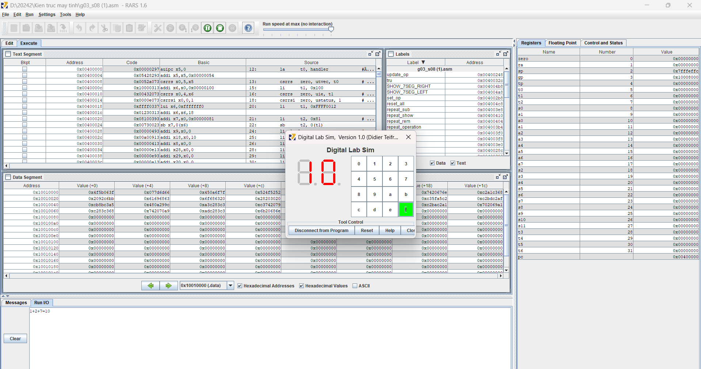

# Computer-Architecture
- Pocket calculator programming and music playback system available
# Technology
- Assembly

# Getting started
Use rars software to program, connect peripherals such as keypad, 7-segment LED

https://github.com/user-attachments/assets/d7015f4e-1b79-4ec3-a152-d0921e8644f6

